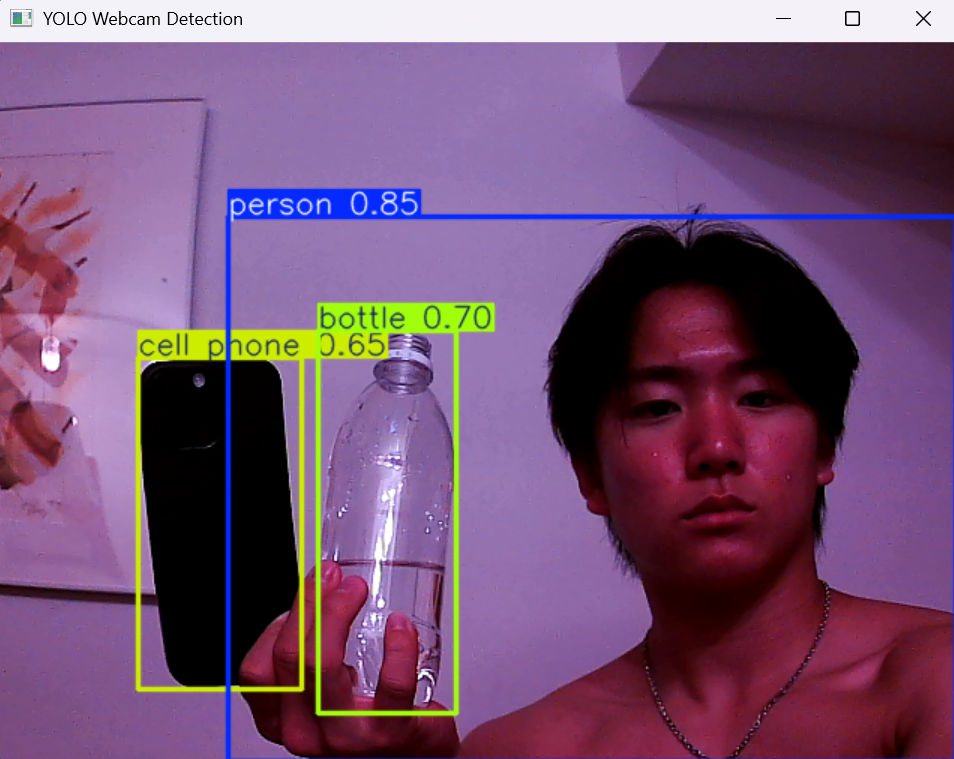

# AI Autonomous Drone for Real-Time Object Tracking and 3D-Aware Navigation

## Project Overview

This project explores the design and development of an AI-assisted autonomous drone system capable of identifying, tracking, and following a selected non-human target in a controlled environment. The system will combine computer vision, drone control, sensor integration, and path planning to study how a low-cost drone can perform real-time object tracking and navigation.

The goal is not to create a surveillance weapon or privacy-invasive system, but to build a safe research prototype for autonomous navigation, perception, and robotics experimentation.

## Main Objective

To build and test an AI-powered drone system that can:

* Detect a selected object using computer vision
* Track the object's movement in real time
* Estimate the object's position relative to the drone
* Plan basic movement paths toward or around the object
* Avoid simple obstacles in a controlled testing environment
* Collect performance data for research and science fair presentation

## Research Question

How effectively can a low-cost autonomous drone use real-time computer vision and sensor-based navigation to track a selected object while maintaining stable and safe movement in a controlled environment?

## Planned Features

### Minimum Viable Product

* Object detection using camera input
* Real-time object tracking
* Drone simulation before physical testing
* Basic autonomous movement toward a target
* Manual override and emergency stop
* Performance data collection

### Advanced Goals

* 3D mapping or depth estimation
* Obstacle avoidance
* Path planning
* Integration with onboard compute hardware
* Real-world indoor drone testing
* Research paper and science fair submission

## Tech Stack

* Python
* OpenCV
* YOLO or another object detection model
* ROS 2
* Gazebo simulation
* ArduPilot or PX4
* Raspberry Pi or Jetson onboard computer
* Camera module
* IMU and flight controller sensors

## Project Structure

```text
ai-autonomous-drone-object-tracking/
│
├── README.md
├── docs/
│   ├── project_proposal.md
│   ├── roadmap.md
│   ├── research_log.md
│   └── safety_ethics.md
│
├── simulation/
│   ├── gazebo/
│   └── ros2_nodes/
│
├── vision/
│   ├── object_detection/
│   └── tracking/
│
├── navigation/
│   ├── path_planning/
│   └── obstacle_avoidance/
│
├── hardware/
│   ├── parts_list.md
│   ├── wiring_diagrams/
│   └── build_photos/
│
├── experiments/
│   ├── test_results/
│   └── videos/
│
└── paper/
    ├── outline.md
    └── draft.md
```

## Current Status

Project started. The first stage focuses on research, planning, simulation setup, GitHub documentation, and safe hardware selection.

## Milestone 1: Real-Time Object Detection

Successfully implemented a real-time object detection pipeline using a USB Arducam and the YOLOv8 object detection model.

## Results

| Object Detection Demo |
|----------------------|
|  |

Detected objects:
- Person
- Bottle
- Cell Phone

### Features

* Live video feed from external USB camera
* Real-time object detection
* Automatic bounding box generation
* Object classification using pretrained YOLOv8

### Technologies Used

* Python
* OpenCV
* Ultralytics YOLOv8
* Arducam USB Camera

### Future Work

* Object tracking
* Target selection
* Autonomous target following
* Drone integration

## Milestone 2: Target Tracking and Motion Prediction

Successfully expanded the object detection pipeline into a target tracking system capable of selecting and following a specific object across multiple frames.

The system automatically identifies a cell phone, assigns it as the target, predicts future target positions using a Kalman Filter, and provides directional guidance relative to the center of the camera frame.

## Results

| Target Tracking Demo                 |
| ------------------------------------ |
|  |

### Features

* Automatic target selection
* Hybrid YOLO + CSRT tracking architecture
* Kalman Filter motion prediction
* Real-time target position estimation
* Directional guidance system
* Visual target persistence
* Automatic target reacquisition
* Reduced identity switching
* Live camera visualization

### Example Output

```text
Target selected: Cell Phone

Target Center: (415, 228)
Predicted Error X: 42, Y: -18

MOVE RIGHT | CENTERED Y
```

### Technologies Used

* Python
* OpenCV
* Ultralytics YOLOv8
* ByteTrack
* Kalman Filters
* NumPy

### Challenges Encountered

* Target identity loss during rapid motion
* Motion blur affecting object detection
* ByteTrack reassigning new IDs after occlusion
* Kalman prediction drift during long target loss periods

### Lessons Learned

* Object detection and object tracking are fundamentally different problems
* Kalman Filters improve stability but do not solve identity tracking
* Multi-object trackers are susceptible to ID switching
* Robust tracking requires combining detection, tracking, prediction, and re-identification

### Future Work

* CSRT visual tracker integration
* Appearance-based target re-identification
* High-speed target tracking improvements
* Target tracking under occlusion
* Simulation-based testing environment
* Drone control system integration

## Milestone 3: Autonomous Drone Tracking Simulation

Developed a simulation environment to evaluate autonomous target tracking behavior before physical drone deployment.

The simulation models a drone tracking moving targets using vision constraints, tracking confidence, target selection logic, and autonomous pursuit behavior. Multiple targets can exist simultaneously, allowing the drone to select and maintain lock on a specific target while ignoring distractions.

## Results

| Autonomous Drone Simulation           |
| ------------------------------------- |
|  |

### Features

* Autonomous target following
* Target lock maintenance
* Configurable follow distance
* Search and reacquisition behavior
* Camera field-of-view simulation
* Vision radius constraints
* Tracking confidence system
* Target evasion behavior
* Multi-target environment
* Persistent target selection

### Example Behaviors

```text
Target detected
↓
Target selected
↓
Drone tracks target
↓
Target leaves field of view
↓
Drone searches
↓
Target reacquired
```

### Technologies Used

* Python
* OpenCV
* NumPy
* State-Based Control Logic
* Autonomous Tracking Algorithms

### Challenges Encountered

* Designing realistic autonomous behavior
* Implementing search and reacquisition states
* Managing target selection in multi-target environments
* Balancing tracking aggressiveness with follow distance constraints

### Lessons Learned

* Tracking a target and controlling a vehicle are fundamentally different challenges
* Autonomous systems require state management beyond simple tracking
* Target selection and persistence are critical for multi-object environments
* Simulation provides a safe environment for validating autonomy algorithms before hardware deployment

### Future Work

* Target memory and advanced reacquisition logic
* Multi-target prioritization
* Threat and importance scoring systems
* 3D simulation using PyBullet
* Integration with the real YOLO-CSRT tracking pipeline
* Physical drone implementation


## Safety and Ethics

This project will focus on tracking assigned non-human objects in controlled environments. Human face recognition and privacy-invasive surveillance will not be used as the main demonstration. All testing will include manual override, safe flight boundaries, and controlled indoor or approved outdoor environments.

## Long-Term Goal

By the end of the summer, the goal is to produce a working prototype or simulation-supported system, collect experimental results, write a research paper, and prepare the project for science fair submission.
