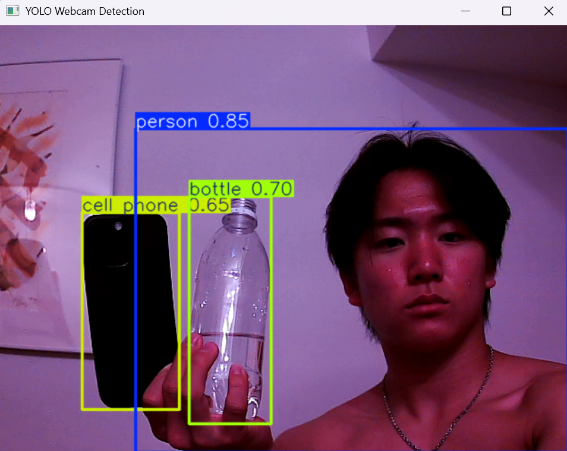
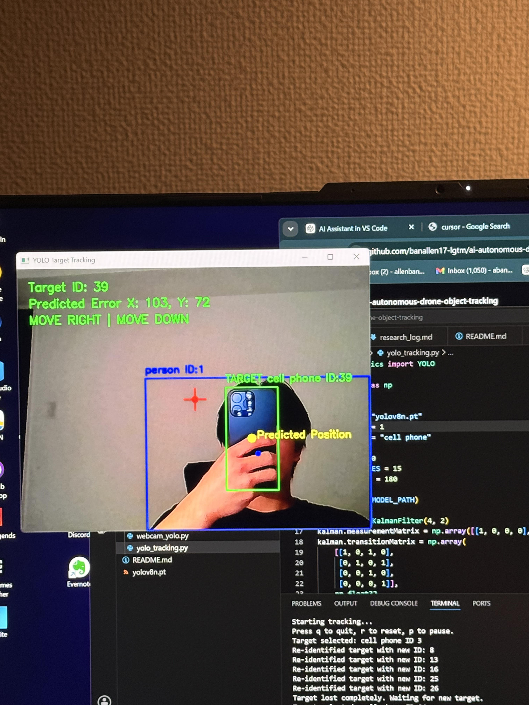

# AI Autonomous Drone for Real-Time Object Tracking and 3D-Aware Navigation

A research project exploring camera-based tracking of an assigned non-human object and autonomous following in a controlled environment.

**Current stage:** separate live-camera vision and 2D simulation prototypes. The latest implementation baseline is commit `9a824be` (September 16, 2026). The immediate priority is repository cleanup, followed by simulation and vision correctness, repeatable evaluation, and refinement.

## What works today

- USB-camera object detection with YOLOv8.
- Cell-phone acquisition with YOLO, frame-to-frame CSRT tracking, Kalman prediction, and virtual movement indications.
- A 2D multi-target simulation with manual target selection, field-of-view limits, following distance, separate camera/body headings, target memory, and predicted search positions.
- Research notes documenting development from June 5 through June 10, plus a September repository review.

These are prototype capabilities recorded in code and research notes, not measured guarantees of tracking accuracy. The simulation does not run YOLO on rendered camera images. The vision overlay's virtual center is not a physical camera or flight simulation. No flight-controller connection is implemented.

## Repository map

| Path | Purpose |
| --- | --- |
| [simulation/drone_tracking_advanced.py](simulation/drone_tracking_advanced.py) | Primary simulation for the next fixes and refinements |
| [simulation/simulation/drone_tracking_v2.py](simulation/simulation/drone_tracking_v2.py) | Earlier multi-target/gimbal prototype, retained for comparison |
| [simulation/2d_drone_tracking_sim.py](simulation/2d_drone_tracking_sim.py) | Original single-target pursuit demo |
| [vision/object_detection/yolo_tracking.py](vision/object_detection/yolo_tracking.py) | Primary live-camera tracker |
| [vision/object_detection/webcam_yolo.py](vision/object_detection/webcam_yolo.py) | Detection-only demo |
| [vision/object_detection/camera_test.py](vision/object_detection/camera_test.py) | Camera-index diagnostic |
| [docs/roadmap.md](docs/roadmap.md) | Completed milestones and ordered next tasks |
| [docs/system_architecture.md](docs/system_architecture.md) | Current components and planned integration |
| [docs/research_log.md](docs/research_log.md) | Historical development notes |
| [docs/hardware_selection.md](docs/hardware_selection.md) | Preliminary hardware options; not a purchase/build record |
| [docs/project_proposal.md](docs/project_proposal.md) | Original research scope and hypothesis |
| [docs/object_tracking_plan.md](docs/object_tracking_plan.md) | Vision repair and evaluation plan |
| [docs/safety_ethics.md](docs/safety_ethics.md) | Controlled testing and project scope |
| [CONTRIBUTING.md](CONTRIBUTING.md) | Change and validation workflow |

Historical simulation paths remain available. Use the advanced script for new simulation work.

## Run locally

The current camera scripts use Windows DirectShow. Run commands from the repository root so `yolov8n.pt` resolves correctly. The dependency snapshot targets Windows x64 and Python 3.12 with CPU inference.

Create an isolated environment without changing the system Python installation:

```powershell
py -3.12 -m venv .venv
.\.venv\Scripts\python.exe -m pip install --no-deps --only-binary=:all: -r vision/object_detection/requirements.txt
.\.venv\Scripts\python.exe -B tools/check_environment.py
```

The complete pinned snapshot uses only `opencv-contrib-python`, which supplies CSRT and desktop display support. **Keep `--no-deps` in the install command:** ordinary Ultralytics dependency resolution would install a conflicting regular OpenCV package. The environment check validates the explicit substitution and exercises CSRT and YOLO without opening a camera. See [dependency setup](docs/dependencies.md) for the expected `pip check` metadata warning, supported platform, and upgrade procedure.

Run one demo at a time:

```powershell
.\.venv\Scripts\python.exe simulation/drone_tracking_advanced.py
.\.venv\Scripts\python.exe vision/object_detection/webcam_yolo.py
.\.venv\Scripts\python.exe vision/object_detection/yolo_tracking.py
```

- Simulation: `q` quits; `0`, `1`, or `2` selects a target.
- Tracker: `q` quits; `p` pauses/resumes; `r` resets while running.
- Camera index defaults to `0`. Use the diagnostic script to inspect camera availability.
- Camera/model settings currently live inside the scripts; command-line configuration is planned.

The existing YOLO weight file is retained to preserve the current launch path. Its checksum and the limits of its recorded provenance are documented in [dependency setup](docs/dependencies.md).

## Progress and evidence

1. **June 2026: detection.** USB-camera YOLO detection demonstrated and documented.
2. **June 2026: tracking.** ByteTrack experiments progressed to YOLO + CSRT + Kalman tracking.
3. **June 2026: simulation.** Pursuit expanded into multi-target tracking, memory, reacquisition, and camera/body heading separation.
4. **September 16, 2026: latest code update.** Added the advanced simulation with velocity prediction; revised tracker loss handling and optional YOLO correction.

Historical detection screenshot:



Historical tracking screenshot (not a validation of the latest tracker):



No simulation screenshot is currently tracked. Performance datasets, automated behavioral tests, and hardware flight results are not yet included.

## Next milestone

Establish a reliable baseline before adding features:

1. Complete repository setup and dependency reproducibility.
2. Repair simulation target resets, search/gimbal behavior, visibility handling, timing, and boundaries.
3. Repair vision reacquisition, prediction/control validity, reset behavior, and configurable inputs.
4. Add repeatable scenarios and recorded-video evaluation with quantitative metrics.
5. Define a shared observation/control interface before connecting vision to simulation.

See the [roadmap](docs/roadmap.md) for acceptance criteria. 3D simulation, obstacle avoidance, ROS 2/Gazebo, onboard computing, and physical drone integration are future work.

## Repository checks

```powershell
python -B tools/check_repository.py
git diff --check
```

These checks validate Python syntax and relative Markdown file links without importing camera scripts or downloading models. They do not validate tracking behavior. GitHub Actions runs the same repository check.

## Research goal

How effectively can a low-cost autonomous drone use real-time computer vision and sensor-based navigation to track a selected object while maintaining stable movement in a controlled environment?

Testing follows the [safety and ethics plan](docs/safety_ethics.md). The intended outcome is a validated prototype or simulation-supported demonstration, experimental results, and research presentation materials. The original summer target remains historical; a revised delivery date has not been set.
